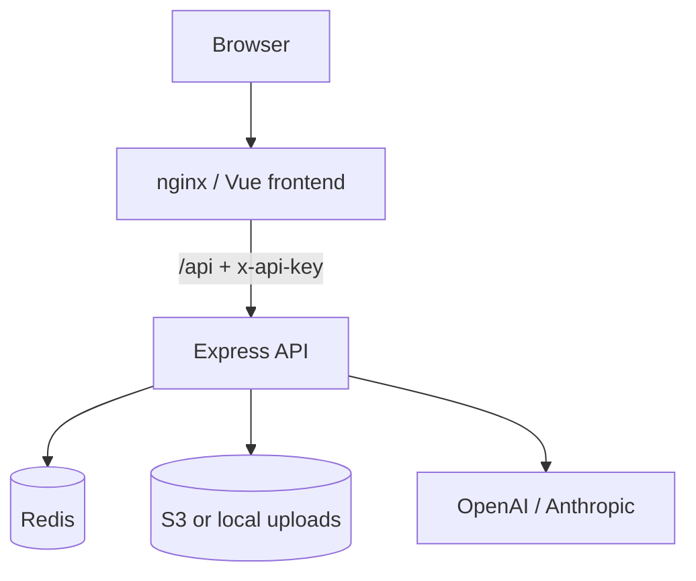
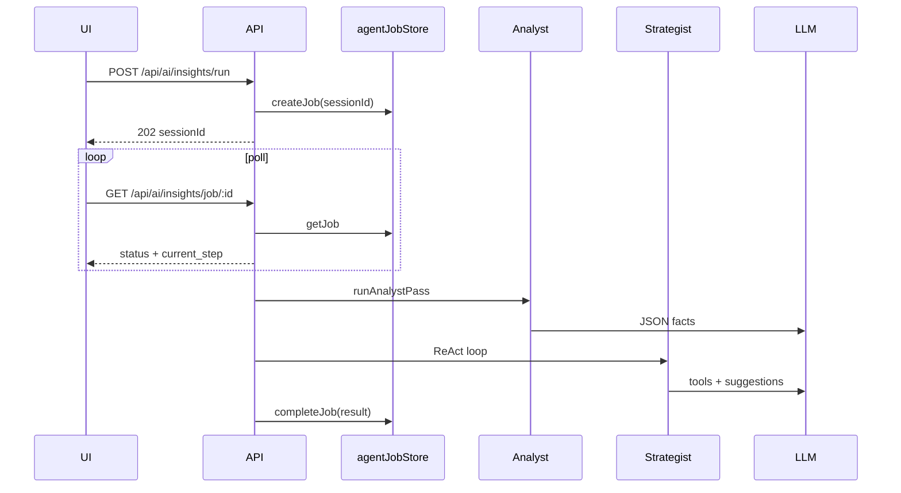

# Architecture

## High-level

## Multi-agent insights flow

## Data flow (Excel)

1. User uploads `.xlsx` → validated → `StorageProvider`
2. Routes read workbook via `readWorkbookFromUpload`
3. Dashboards / AI tools consume parsed sheets (Wizyty, Sprzedaż, Faktury)
4. Agent cache key = filename mtime + size + prompt version + provider

## Security layers

- API key on `/api/*` (except health)
- CORS whitelist
- Per-route rate limits + daily LLM budget
- Path traversal protection on filenames
- PII scrubbing in trace logs only (not in business logic)
